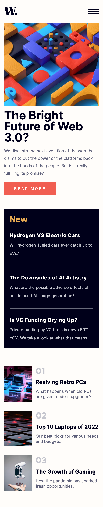
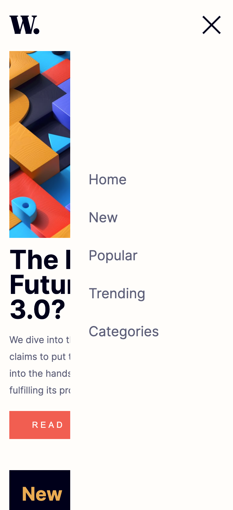
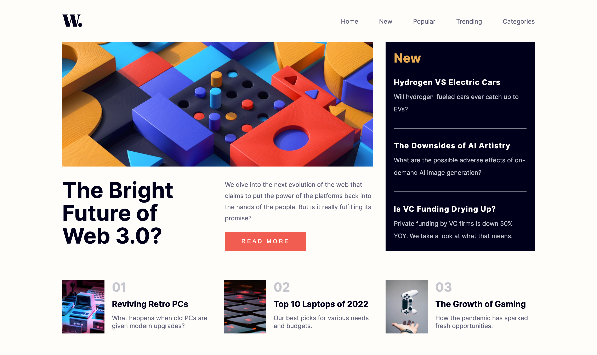

# PING Coming Soon Page
Esta es una solución de [News homepage on Frontend Mentor](https://www.frontendmentor.io/challenges/news-homepage-H6SWTa1MFl/hub/news-homepage-Iz6GNxD9eP). 

## Tabla de contenidos

- [Resumen](#resumen)
    - [Desafio](#desafio)
    - [Screenshots](#screenshots)
    - [Links](#links)
- [Proceso](#proceso)
    - [Hecho con](#hecho-con)
    - [Lo que aprendí](#lo-que-aprendí)

## Resumen

### Desafío

Los usuarios deben ser capaces de:

- Visualizar adecuadamente el diseño, tanto en mobile (375px) como en desktop (1440px). Para mobile el diseño cuenta con un ícono de hamburguesa el cual al ser tocado despliega el menú. Sin embargo, en la versión desktop el ícono no existe y el menú se encuentra dentro de la barra de navegación.
- Ver los elementos interactivos de la página como ser enlaces y botones.
- En la versión mobile, el usuario puede desplegar el menú al tocar el ícono correspondiente y ocultar el menú al tocar la X.

### Screenshots

La vista completa de la página en mobile con un width de 375px se ve de la siguiente manera:

Cuando el usuario toca el ícono de hamburguesa se despliega con un efecto suave desde la derecha el menú en mobile.

Mientras que si el usuario usa un desktop, la vista se amplía:

El usuario puede interactuar con los elementos de la página, al ubicarse sobre el menú en la barra de navegación, las letras cambiaran de color. Al colocarse sobre el botón **READ MORE** el mismo cambiará el color de su fondo. Finalmente al posicionarse sobre los títulos de los artículos, estos cambiaran de color.

### Links

- Solución en Frontend Mentor: [Frontend Mentor](https://www.frontendmentor.io/solutions/news-homepage-IXcswBZ6nU)
- Live Site: [GitHub Pages](https://diegoesdev.github.io/news-homepage/)

## Proceso

### Hecho con

- HTML5
- CSS3
- JavaScript
- Flexbox
- CSS Grid
- Mobile First 

### Lo que aprendí

Con este desafío puse a prueba mis habilidades con CSS Grid, ya que era el ejercicio perfecto para practicar con esta herramienta de CSS. Apliqué CSS Grid en los elementos de mayor tamaño, sin embargo, para los elementos más pequeños se usó Flexbox.

A partir de JavaScript es posible crear un menú en la vista mobile que al presionar un ícono, este se desplace, y al presionar el ícono de cerrar, este se cierre.

> No pares de aprender.